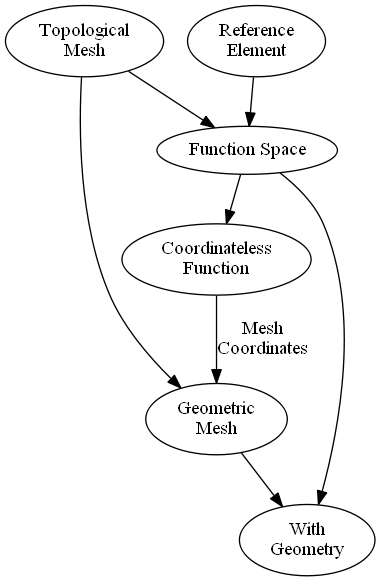

interop
=======

Interfacing with data outside of :mod:`meshmode`.

Firedrake
---------

Function Spaces/Discretizations
^^^^^^^^^^^^^^^^^^^^^^^^^^^^^^^

.. automodule:: meshmode.interop.firedrake.connection

Meshes
^^^^^^

.. automodule:: meshmode.interop.firedrake.mesh

Reference Cells
^^^^^^^^^^^^^^^

.. automodule:: meshmode.interop.firedrake.reference_cell

Implementation Details
^^^^^^^^^^^^^^^^^^^^^^

Converting between :mod:`firedrake` and :mod:`meshmode` is in general
straightforward. Some language is different:

* In a mesh, a :mod:`meshmode` "element" is a :mod:`firedrake` "cell"
* A :mod:`meshmode` :class:`Discretization` is a :mod:`firedrake`
  :class:`WithGeometry` created, usually
  created to using the function :func:`FunctionSpace` and referred
  to as a "function space"
* In a mesh, any vertices, faces, cells, etc. are :mod:`firedrake`
  "entities" (see `dmplex <https://www.mcs.anl.gov/petsc/petsc-current/docs/manualpages/DMPLEX/index.html>`_
  for more info on how topological mesh information is stored
  in :mod:`firedrake`).

Other than carefully tabulating how and which vertices/faces
correspond to other vertices/faces/cells, there are two main difficulties.

1. :mod:`meshmode` requires that all mesh elements be positively oriented,
   :mod:`firedrake` does not.
2. :mod:`meshmode` has discontinuous polynomial function spaces
   which use different nodes than :mod:`firedrake`.

Consequently, any :mod:`firedrake` :class:`firedrake.function.Function`
whose data is converted onto a corresponding :class:`Discretization`
using a :class:`FromFiredrakeConnection` instance is
first reordered (as the converted mesh was reordered to have
positively oriented elements) and then resampled at the :mod:`meshmode`
nodes.

For Developers: Firedrake Function Space Design Crash Course
^^^^^^^^^^^^^^^^^^^^^^^^^^^^^^^^^^^^^^^^^^^^^^^^^^^^^^^^^^^^

In firedrake, meshes and function spaces have a close relationship.
In particular, this is  due to some structure described in this
`firedrake pull request <http://github.com/firedrakeproject/firedrake/pull/627>`_.
If you wish to develop on / add to the implementation of conversion
between :mod:`meshmode` and :mod:`firedrake`, you will need
to understand their design style. Below is a crash course.

In short, it is the idea
that every function space should have a mesh, and the coordinates of the mesh
should be representable as a function on that same mesh, which must live
on some function space on the mesh... etc.
Under the hood, we divide between topological and geometric objects,
roughly as so

(1) A reference element defined using :mod:`FInAT` and :mod:`fiat`
    is used to define what meshmode calls the unit nodes and unit
    vertices. It is worth noting that :mod:`firedrake` does
    not require a positive orientation of elements and that its
    reference traingle is different than specified in :mod:`modepy`. 

(2) A ``MeshTopology`` which holds information about connectivity
    and other topological properties, but nothing about geometry/coordinates
    etc.

(3) A ``FunctionSpace`` created from a ``FInAT`` element and a
    ``MeshTopology`` which allows us to define functions 
    mapping the nodes (defined by the ``FInAT`` element) of 
    each element in the ``MeshTopology`` to some values

(4) A ``CoordinatelessFunction`` (in the sense that its
    *domain* has no coordinates) which is a function
    in a ``FunctionSpace``

(5) A ``MeshGeometry``  created from a ``FunctionSpace``
    and a ``CoordinatelessFunction`` in that ``FunctionSpace``
    which maps each dof to its geometric coordinates.

(6) A ``WithGeometry`` which is a ``FunctionSpace`` together
    with a ``MeshGeometry``. This is the object returned
    usually returned to the user by a call
    to the :mod:`firedrake` function :func:`FunctionSpace`.

(7) A ``Function`` is defined on a ``WithGeometry``

Thus, by the coordinates of a mesh geometry we mean

(a) On the hidden back-end: a ``CoordinatelessFunction`` *f* on some function
    space defined only on the mesh topology
(b) On the front-end: A ``Function`` with the values of *f* but defined
    on a ``WithGeometry`` created from the ``FunctionSpace`` *f* lives in
    and the ``MeshGeometry`` *f* defines.

Basically, it's this picture (where a->b if b depends on a)

.. warning::

    In general, the ``FunctionSpace`` of the coordinates function
    of a ``WithGeometry`` may not be the same ``FunctionSpace``
    as for functions which live in the ``WithGeometry``.
    This picture
    only shows how the class definitions depend on each other.
            

