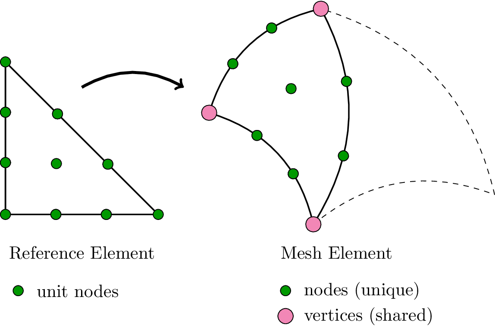

Common infrastructure
=====================

.. automodule:: meshmode

Mesh management
===============

.. currentmodule:: meshmode.mesh

Design of the Data Structure
----------------------------

Why does a :class:`Mesh` need to be broken into :class:`MeshElementGroup` instances?
^^^^^^^^^^^^^^^^^^^^^^^^^^^^^^^^^^^^^^^^^^^^^^^^^^^^^^^^^^^^^^^^^^^^^^^^^^^^^^^^^^^^

Elements can be of different types (e.g. triangle, quadrilateral,
tetrahedron, what have you). In addition, elements may vary in the
polynomial degree used to represent them (see also below).

All these bits of information could in principle be stored by element,
but having large, internally homogeneous groups is a good thing from an
efficiency standpoint. (So that you can, e.g., launch one GPU kernel to
deal with all order-3 triangles, instead of maybe having to dispatch
based on type and size inside the kernel)

What is the difference between 'vertices' and 'nodes'?
^^^^^^^^^^^^^^^^^^^^^^^^^^^^^^^^^^^^^^^^^^^^^^^^^^^^^^

Nodes exist mainly to represent the (potentially non-affine) deformation of
each element, by a one-to-one correspondence with
:attr:`MeshElementGroup.unit_nodes`.  They are unique to each element. Vertices
on the other hand exist to clarify whether or not a point shared by two
elements is actually identical (or just happens to be "close"). This is done by
assigning (single, globally shared) vertex numbers and having elements refer to
them.

Consider the following picture:

Mesh Data Structure
-------------------

.. automodule:: meshmode.mesh

Mesh generation
---------------

.. automodule:: meshmode.mesh.generation

Mesh input/output
-----------------

.. automodule:: meshmode.mesh.io

Mesh processing
---------------

.. automodule:: meshmode.mesh.processing

Mesh refinement
---------------

.. automodule:: meshmode.mesh.refinement

Mesh visualization
------------------

.. automodule:: meshmode.mesh.visualization

.. vim: sw=4
